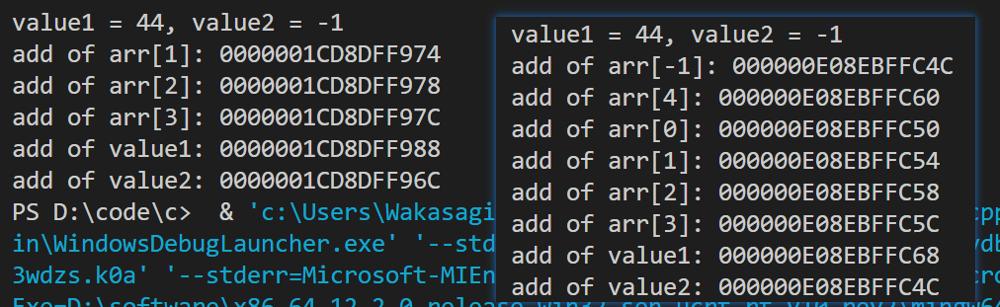
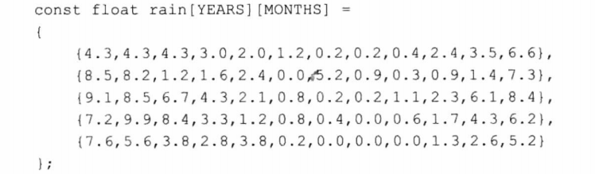
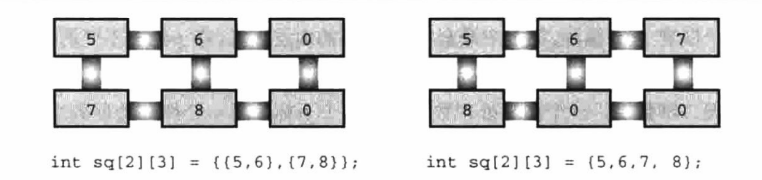
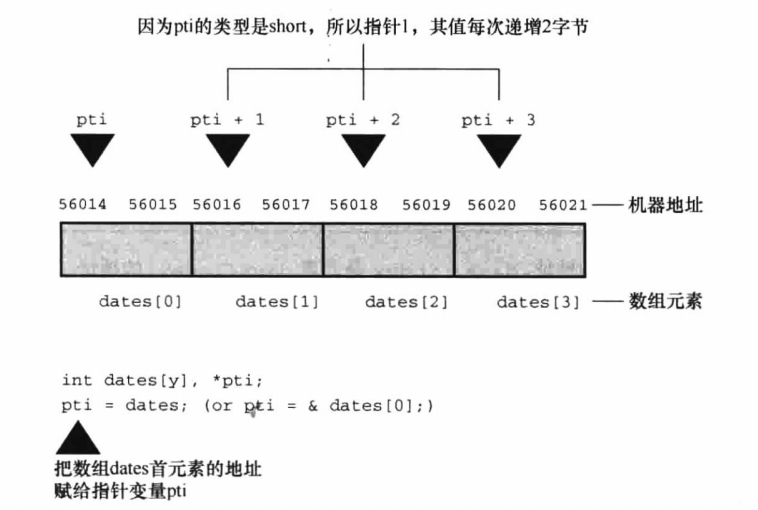
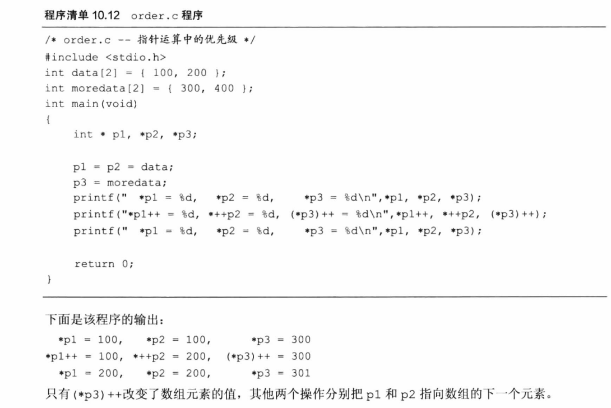
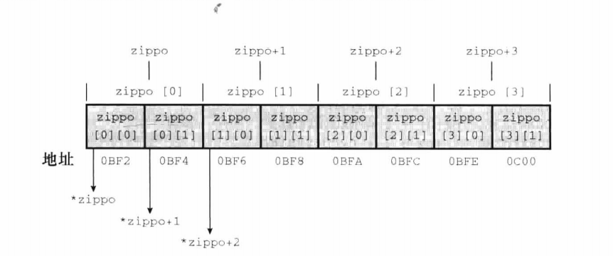
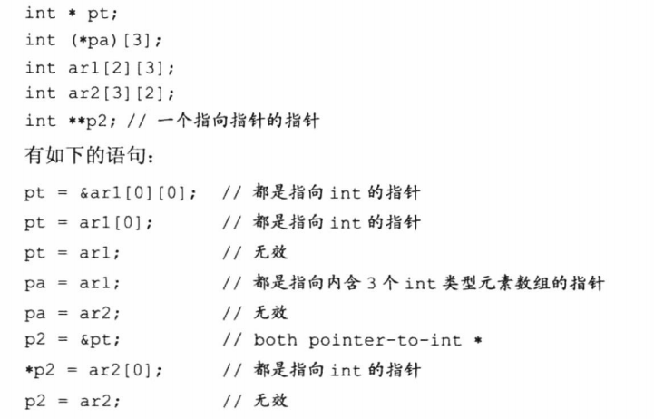

# C Primer Plus Chapter 10

数组和指针

## 数组

1. 数组的声明例如：const int days[MONTHS] = {31, 28, 31, 30, 31, 30, 31, 31, 30, 31, 30, 31};

    推荐此种宏定义数组大小的写法。
2. 数组需要初始化，若初始化列表少于元素个数时，剩余元素将被置0。注意定义时[ ]内数字为数组大小，不是数组最大下标，别逸出。若用花括号初始化，可省略[ ]内数字，系统会自动计数项数。
3. sizeof days是整个数组的大小，sizeof day[0]是一个元素的大小，二者相除即可知道有多少元素。
4. 指定初始化：C99标准允许int a[3] = {1, [1] = 2, 3}; 若指定初始化情况省略数组大小，则数组将是最小的可容纳初始化的大小，比如a[] = {a[6] = 1, 2, 3}，则a大小为a[9]。
5. 除了初始化之外，不允许花括号赋值。也不允许把数组作为一个单元赋给另一个数组(yaks = oxen)。
6. C语言不检查数组下标越界问题，若使用了越界下标，可能会导致改变其他变量的值（因为本身可能存储了别的数）。每个编译器运行结果不太一样，比如我的就不是按照定义顺序安排地址的，而且不是每次都能打印出全部结果，所以不要越界。
    
7. 数组方括号内必须为整形常量，可用表达式和sizeof，强制类型转换等。C99标准后允许变长数组（即数组长度为变量），如下：

    ```c
    int n = 5;
    float arr[n];
    ```

8. 多维数组初始化：
    
    使用多个花括号进行单维初始化，前面单维初始化规则对此依然试用。
    
    若使用单个花括号，则优先填满各层。

9. 数组名即为数组首个元素的地址。
10. 指针加1是指向下一个存储单元，而不是地址增加1个字节，也就是说，short类型指针加1，地址会增加两个字节，double会增加8个字节。arr + 2即为arr[2]的地址。
    
11. 间接运算符*优先级高于+-，即不要混淆\*arr + 2和\*(arr + 2)。
12. 只有在定义函数或函数原型时，才可用int arr[]代替int *arr，都表示指向int的指针, int arr[]只能用来声明形参，同时说明这是一个数组型元素。
13. sizeof(arr)结果为八字节，因C语言用8字节存储地址。
14. 除了传递数组起始地址和数组个数外，还可以传递起始和终止地址，并在函数中while(start<end)
15. 使用“越界”的指针使函数更加简洁，如使用marbles+SIZE而非marbles+SIZE-1。数组保证marbles+SIZE是指向数组最后一个元素的后面，但这个地址上存的数是多少并不能保证。
16. 优先级问题：
    
17. 比如，将double类型数组赋给int类型指针，vscode只报warning。且应该是进行了强制类型转换。但是尽量不要这么干。
18. 指针本身也有地址，&p和p不是一个东西，误混淆。对p进行+-操作不影响指针本身地址。
19. 指针与整数相加时，若结果超出了初始指针指向的数组范围，计算结果是未定义的，除非正好超过末尾一个位置。VSCode输出是继续往后加sizeof(arr)。递减同理。
20. 指针可以进行求差运算，若指向不同数组的指针进行求差本系统会直接报错退出。允许小减大，会得到负数。
21. 不要用野指针。未初始化指针指向位置就进行赋值、加减等操作会出现未知问题。本系统将直接报segmentation fault并退出运行。
22. 保护数据：若函数不需要更改数组的值，可用const关键字以避免错误编程造成的原始数据修改。即：int sum(const int ar[], int n); 此处const关键字作用是，若函数修改了ar指向的数组中的内容，编译器会报错。
23. const的用法：可以创建const数组、const指针和指向const的指针。const数组不能修改其值，const指针不可用*修改其值，但让其指向别处是允许的。而指向const的指针即在函数中声明不可改变的形参。
24. 把const数据和非const数据的地址初始化给指向const 的指针使合法的。但把const数据地址赋给普通指针不合法。
25. 使用函数去传递const并修改const数据导致的结果是未定义的。本系统会继续修改数值并报warnings。
26. const位置问题：如double \* const pc = rates; 指该指针可以修改它所指向的值，但是不能修改它指的位置(必须在定义这行就初始化）。const double * const pc = rates; 既不能修改值也不能修改位置。

## 多维数组

int zippo\[4][2];

1. 数组名zippo是一个内含两个int值的数组，这个两个int的数组的地址。
2. zippo即为&zippo[0]，zippo[0]即为&zippo\[0][0]，二者起始地址相同，但是zippo内含两个int大小，zippo[0]只有一个int大小。
3. 给指针增加1，其值会增加对应类型大小（即挪到下一个同类型上），而在这方面zippo+1和zippo[0]+1不同！
4. *(zippo[0])表示存储在zippo\[0][0]上的值。\*zippo表示zippo[0]的值，但因为zippo[0]就是一个int类型的地址，即\*zippo = &zippo\[0][0]，所以\*\*zippo = \*&zippo\[0][0]，即**zippo为zippo\[0][0]，即必须解引用两次才能获得原始值。
    
5. 指向多维数组的指针：

    int (*pz)\[2]:指向一个内含两个int类型值的数组

    int \*pz[2]:内含两个指针元素的数组

    两种类型勿混淆。[]优先级高于*。
6. 指针也可以用数组的标号，如p\[m][n] == *(*(p + m) + n)
7. 指针不允许指向不同类型的互相赋值，且不同层数、元素个数等都不可互相赋值。
    
8. 把const指针赋给非const指针不安全，多级解引用非const赋给const也不安全。结果都是未定义的，不要乱赋，const很容易失效。
9. 多维数组的形参：

    ```c
    void sum_rows(int ar[][COLS], int rows);
    void sum_rows(int [][COLS], int); //省略参数名（不建议）
    int sum2d(int (*ar)[COLS], int rows);
    //但是绝不可能是：
    int ar[][]
    ```

## 变长数组

C99新增变长数组。变长数组必须是自动存储类别，不允许使用static或extern，不能在声明中初始化他们。它的变仅仅是维度采用变量而已，但是一旦创建，不可更改。维度变量必须在其之前声明完成。

如在形参中使用：

```c
int sum2d(int rows, int cols, int ar[rows][cols])
```

## 复合字面量

形如：(int[2]){10, 20}、(int[]){10, 20}、(int\[2][4]){{1,2,3,-9},{4,5,6,-8}}，在创建的同时使用即可，省去创建数组名。

典型用法：

```c
total3 = sum((int []){4,4,4,5,5,5}, 6); //无需创建数组，与数组名类似，该变量同时也是首元素的地址。
```
