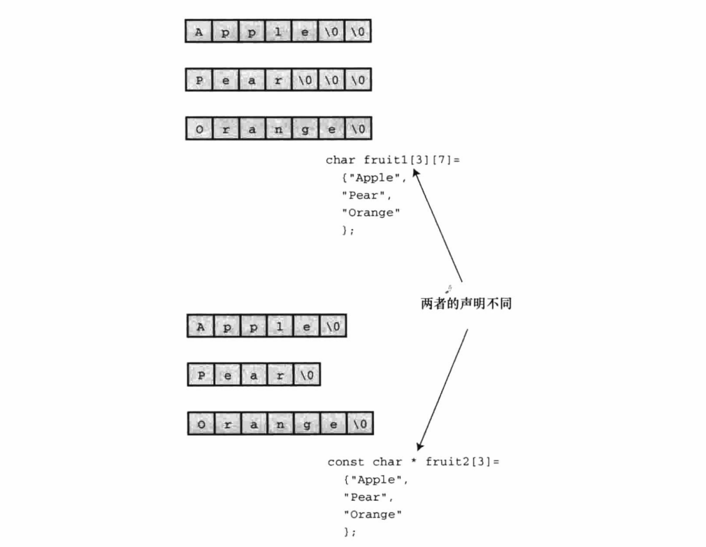
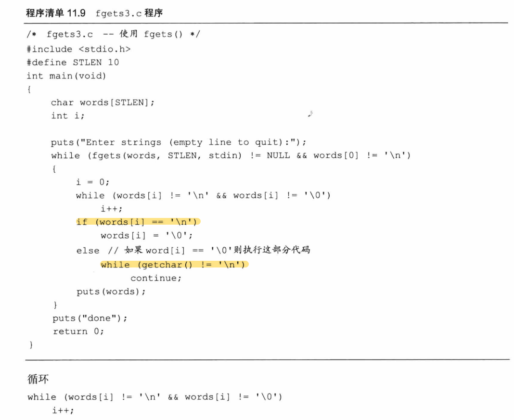
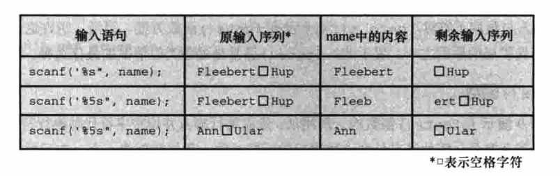
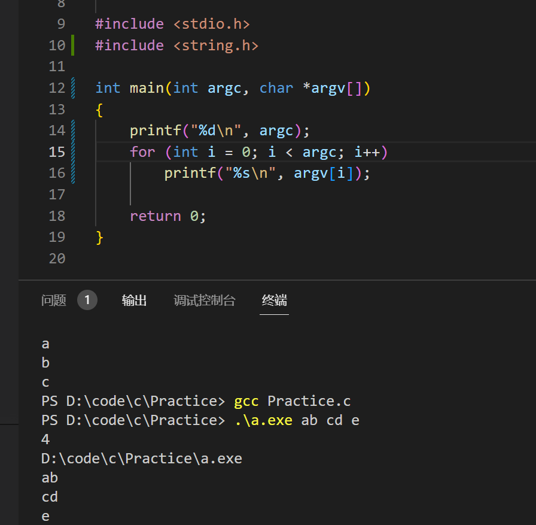
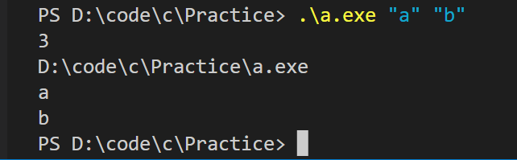

<!--
 * @Date: 2023-03-03
 * @LastEditors: Wakasagihime
 * @LastEditTime: 2023-03-06
 * @FilePath: \\pythond:\\code\\c\\blog\\CPrimerPlusChapter11.md
 * @Description: 
-->
# C Primer Plus Chapter 11

字符串和字符串函数

## 字符串表示和I/O

### 在程序中定义字符串

1. puts()：只显示字符串，并自动在末尾加上换行符。
2. 若字符串字面量之间没有间隔或用空白字符分隔（空格、回车等），c会将其串联。

    ```c
    char greeting[50] = "Hello, and""how are"" you"" today!";
    ```

3. 和数组同理，字符串本身也是指向首元素地址的指针，即用%p打印"abc"将得到a的地址，用%c（或%d等）（但是不能用此方法打印%s）打印*"abc"可得到'a'。
4. 字符串初始化：要保证长度至少大于字符个数+1（因有'\0'）（可以省略字符个数让编译器自行计算），未被初始化的部分自动补为'\0'。

    ```c
    const char ml[40] = "Limit yourself to one line's worth.";
    ```

5. 字符串常量属于静态存储类别，即若在函数中使用字符串常量，该字符串只会被存储一次，在整个程序的生命周期内存在。
6. 数组和指针：
    - 字符串存储在静态存储区中，若使用数组形式，则在程序开始运行时，系统将字符串拷贝到这个数组中（因程序开始运行才会给数组分配内存）。
    - 数组名指向元素首地址，是地址常量，不可以更改，不能使用递增等操作。
    - 使用指针形式（const char *pt1 = "..."）则不拷贝字符串，而是让指针指向字符串首地址。指针地址可以被改变。
    - 使用指针形式请务必加const，因字符串字面量是常量。若不加const并试图修改字符串的值其结果未定义。本编译器会直接报错。但数组形式字符串是可更改的，因为是字符串的副本。
    - 规则数组与不规则数组：
    
    使用不规则数组创建更合理：占用空间更小，使用效率更高、数组大小可不定。

### 指针和字符串

&emsp;&emsp;若如此定义字符串：

```c
const char *mesg = "...";
const char *copy;

copy = mesg;
```

&emsp;&emsp;字符串并不会再被拷贝一次，而是让copy指针直接指向mesg所指位置，因为这样效率更高！

&emsp;&emsp;由此，若指针所指向的地址的值是可改变的，则解引两指针的值将都会被改变：

### 字符串输入

1. 为字符串分配空间，不可以写出如下代码：

    ```c
    char *name
    scanf("%s", name);
    ```

    会随机擦除内存。

    最简单的办法是，在声明时显式指明数组的大小：

    ```c
    char name[81]
    ```

2. **gets()与puts()**：

    &emsp;&emsp;scanf()读取%s在空格就会停止，gets()会读取直至换行符，并丢弃换行符，存储其余字符。puts()同理，输出并自动添加换行符。然而，gets()是一个不安全的函数，因为无法知道是否超过数组上限。本系统编译器在使用gets时不会报warning。

3. **fgets()与fputs()**：

    &emsp;&emsp;fgets第二个参数指明读入字符最大数量，若该参数为n，则最大读入n-1个字符或遇到第一个换行符为止；它读到换行符会储存在字符串中（和gets不同）；第三个参数为要读入的文件，若要从键盘输入，则第三个参数为stdin；fgets返回指向char的指针，若读到文件末尾，则返回空指针NULL。（可以while(fgets()!=NULL)）。

    &emsp;&emsp;fputs不会在末尾自动添加换行符（和puts不同）；第二个参数为输出的文件，若要使用键盘，则为stdout；

    

    注意它如何去掉fgets中的换行符及如何将输入剩余的字符忽略掉。
4. gets_s()函数：

    gets_S(words, STLLEN);
    - 只从标准输入输出中读取，无需第三个参数
    - 丢弃换行符
    - 最大存储STLEN-1个
    - 如果读到最大字符数还没有读到换行符，则把目标数组首字符设为空字符，读取并丢弃随后输入直到换行符或文件末尾，返回空指针。（因此若你不希望退出和丢弃剩余字符，使用fgets是最好的选择）
5. scanf读取字符串：
    
    若不设定输入宽度，同gets一样，可能导致数据溢出。

### 字符串输出

1. puts()函数：

    puts("...");将会打印整个字符串（因字符串常量整体被视为指向首地址的指针）。puts(宏定义)同理。

    其他用法：puts(arr); puts(arr+4); puts(&arr\[5]);

    puts在读到第一个空字符时停止，故千万不要：

    ```c
    char dont[] = {'W', 'O', 'W', '!'};
    puts(dont);
    ```

    因为dont不是一个字符串，故系统会一直打印直到内存中恰好有个空字符。

2. fputs()函数：

    fputs(line, stdout);

    注意和fgets配对使用。

3. printf()函数

    不会在末尾添加换行符。

    打印多个格式、多个字符串更为便宜。

### 自定义输入输出函数

1. 一种常用写法：

    ```c
    while (*string)
        putchar(*string++);
    ```

    指向空字符时，*string及为0，测试条件为假。

### 字符串函数

1. strlen(): 用于统计字符串长度。
2. strcat(): 字符串拼接，接受两个字符串作为参数，将第二个字符串的备份附加在第一个字符串末尾，返回拼接后第一个字符串的地址。
3. strncat(): strcat无法检查第一个数组是否能容纳第二个字符串，同样会导致溢出问题。strncat第三个参数为最大容纳（添加上去的）字符数。（写的时候注意应将n设为strlen-1，因要保证最后一位放空字符以使其是一个字符串）。
4. strcmp(): 字符串比较函数。若两字符串相同则返回0。若第二个字符在第一个字符ASCII表的前面，则返回1，反之返回-1。（本系统只有+-1），strcmp会依次比较字符，空字符在ASCII首位。
5. strncmp(): 第三个参数限定比较前n个。
6. strcpy(): 第一个参数为目标字符串，第二个参数为源字符串。其返回值为目标字符串的地址。（但如果你使用的是strcpy(arr+7,copy)，则返回的地址是arr+7。
7. strncpy(): 第三个参数表明可拷贝的最大字符数。写的时候同样应将n设为strlen-1，并把最后一位设置为空字符。
8. sprintf(): 定义在stdio.h中，第一个参数为目标字符串，其余和printf相同。其输出为组合后的字符串并存储在相应位置，而不是打印在屏幕上。
9. 其他字符串函数：

    - char \*strchr (const char *s, int c); 返回c字符首位置指针。未找到返回空指针。
    - char \*strrchr (const char *s, int c); 返回c最后出现的位置。未找到返回空指针。
    - char \*strpbrk (const char \*s1, const char *s2); 若s1中包含s2字符串中任意字符，则返回指向s1字符串首位置的指针，未找到返回空指针。
    - char \*strstr (const char \*s1, const char *s2); 返回s1中s2字符串出现的首位置，未找到返回空指针。
  
### 字符串排序
  
- 排序指针而非字符串
- 排序算法：遍历，寻找最大，放置顶部。

### ctype.h字符函数与字符串

### 命令行参数

&emsp;&emsp;C编译器允许main()没有参数或有两个参数：

```c
int main(int argc, char *argv[])
```

&emsp;&emsp;第一个参数表示参数计数(argument count)，第二个参数为指向指针的指针（*argv[]和**argv等同），表示参数值(argument value)。如下为命令行参数编译例子：



&emsp;&emsp;系统自动将运行文件本身名字存储在argv[0]，其余参数依次在argv[1]、argv[2]等。空格标志着参数的结束与开始。本系统支持采用双引号标志参数的结束与开始。



### 把字符串转换为数字

&emsp;&emsp;假设你编写的程序需要使用数值命令形参，但是命令形参本身被读取为字符串，你可以使用atoi()函数（用于把字母数字转换为整数）。

&emsp;&emsp;此外，还有atoi()、atol()、atof()；strtol()、strtoul()、strtod()等实用函数定义在stdlib.h头文件内。
