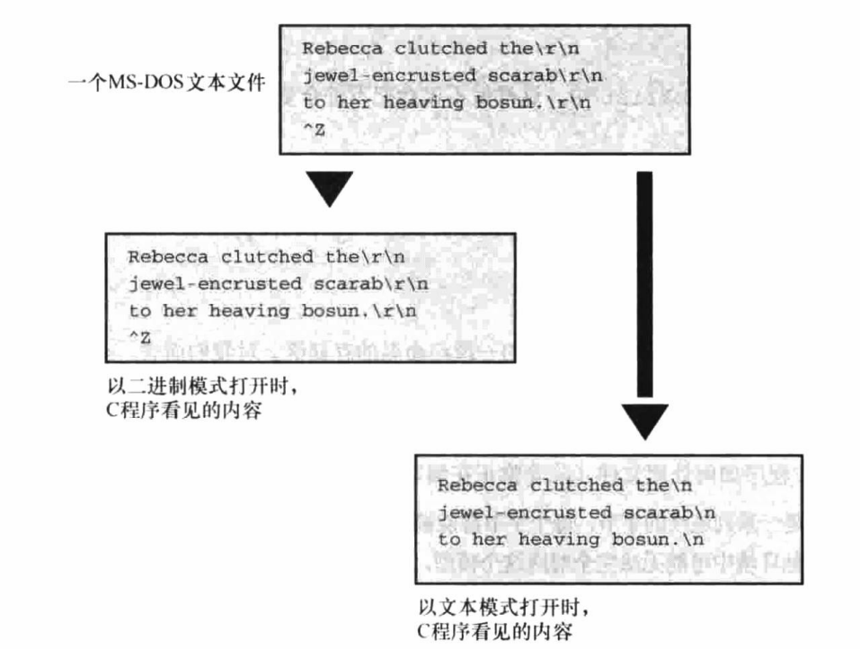
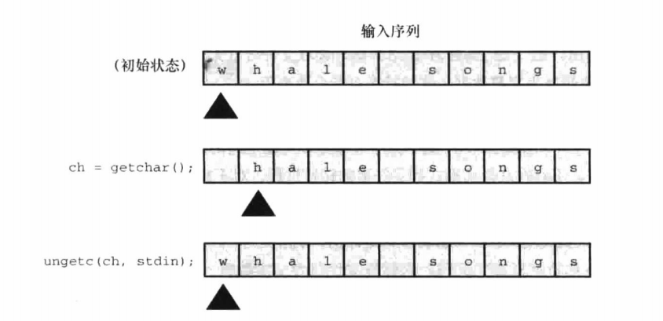
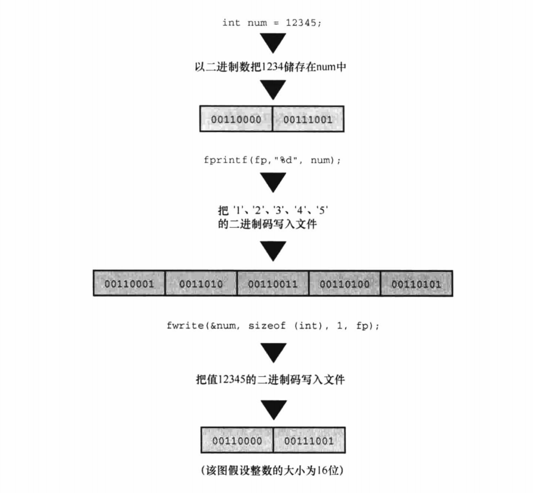

# C Primer Plus Chapter 13

文件输入/输出

## 与文件进行通信

文件通常是磁盘或固态硬盘上的一段已命名的存储区。

### 文本模式与二进制模式

要区分文本内容和二进制内容、文本文件格式和二进制文件格式、文件的文本模式和二进制模式。

- 所有文件的内容都是以二进制形式（0或1）储存，但若文件最初使用二进制编码字符（ASCII或Unicode）表示文本，该文件就是**文本文件**。
- 若文件中二进制值代表机器语言代码或数值数据或图片音乐编码，该文件就是**二进制文件**。

因不同系统文本规范不同（例如不同操作系统换行符表示不同），为规范文本文件的处理，C提供两种访问文件的途径：二进制模式和文本模式。

- **二进制模式**中，程序可以访问文件的每个字节。
- **文本模式**中，C自动将所有不同的部分进行统一（比如换行符转换为\n）。



### I/O的级别与标准文件

I/O有两个可选的级别（即处理文件访问的两个级别）：底层I/O(*low-level I/O*)，使用操作系统提供的基本I/O服务；标准高级I/O(*standard high-level I/O*)，使用C库的标准包和stdio.h头文件。

C程序会自动打开三个文件：标准输入(*standard input*)、标注输出(*standard output*)和标准错误输出(*Standard error output*)。即使把输出重定向到文件，标准错误输出也会直接输出到屏幕上。标准错误的指针是：stderr。

## 标准I/O

### return与exit

ANSI C规定，在最初调用的main()中使用return与调用exit()效果相同，即return 0; 与exit(0);相同。

- 但main必须是最上层的（比如递归就必须回到最上层才有效）。
- return 0;不能用于非main函数的退出，但exit在其他函数中调用也可以结束整个程序。

### fopen()函数

的模式字符串")

C11新增了带x字母的写模式，若打开现有的文件，fopen则会操作失败，原文件内容不会被删除。若条件允许，则x模式的独占性使其他程序或线程无法访问正在被打开的文件。

若使用任何一种“w”模式打开一个现有文件，则该文件的内容会被删除。若使用带x字母的任意一种模式，则无法打开一个现有的文件。

用法示例（定义在stdio中）：

```c
FILE * fp;
fp = fopen("file.txt", "w+");
```

### getc()和putc()函数

使用getc()和putc()函数对文件进行操作，读到文件结尾时返回EOF。示例如下：

```c
ch = getc(fp);
putc(ch, fp);
```

### fclose()函数

```c
fclose(fp);

if (fclose(fp) != 0)
    printf("Error in closing file %s\n", argv[1]);
```

使用fclose是一种好习惯，因文件输入输出都是缓冲输入，写满块后才会输入给程序、刷新缓冲区等，故若不关闭文件，可能导致数据丢失等问题。

比较正式的程序应检查是否关闭成功，因磁盘已满、移动硬盘移除或出现I/O错误等都会导致fclose失败。

## 一个简单的文件压缩程序

```c
// reducto.c - 将原来文件压缩为1/3，每三个字符删掉两个

#include <stdio.h>
#include <stdlib.h> // 提供exit()原型
#include <string.h> // 提供字符串函数原型
#define LEN 40

int main(int argc, char *argv[])
{
    FILE *in, *out; // 声明两个指向FILE的指针
    int ch;
    char name[LEN]; // 存储输出的文件名
    int count = 0;

    // 检查命令行参数
    if (argc < 2)
    {
        fprintf(stderr, "Usage: %s filename\n", argv[0]);
        // 这句话的意思是：“使用帮助：程序名后增加你要压缩的文件名”
        exit(EXIT_FAILURE);
    }

    // 设置输入
    if ((in = fopen(argv[1], "r")) == NULL)
    {
        fprintf(stderr, "I couldn't open the file \"%s\"\n", argv[1]);
        exit(EXIT_FAILURE);
    }

    // 设置输出
    strncpy(name, argv[1], LEN - 5); // 拷贝文件名
    name[LEN - 5] = '\0';
    strcat(name, ".red"); // 在文件名后添加.reduce
    if ((out = fopen(name, "w")) == NULL)
    {
        fprintf(stderr, "Can't create output file.\n");
        exit(EXIT_FAILURE);
    }

    // 拷贝数据
    while ((ch = getc(in)) != EOF)
        if (count++ % 3 == 0)
            putc(ch, out); // 打印每3个字符中的第1个

    // 收尾工作
    if (fclose(in) != 0 || fclose(out) != 0)
        fprintf(stderr, "ERROR in closing files\n");

    return 0;
}
```

## 文件I/O：fprintf()、fscanf()、fgets()和fputs()

fprintf()、fscanf()与printf()、scanf()类似，与putc()等不同的是，其文件指针是第一个参数而不是最后一个参数。

rewind函数接收一个文件指针作为参数，可使指针返回到文件最开始，方便打印出来等操作。

```c
rewind(fp);
```

fgets()第一个参数为存储输入位置的地址(char * 类型)；第二个参数为一个整数，表示最高可读取STLEN-1个字符；最后一个参数是文件指针。fgets会在末尾增加一个空字符使之成为字符串，遇到EOF时返回NULL，若未遇到则返回传给他的地址。

fputs()第一个参数为字符串的地址；第二个参数为文件指针。

fgets保留换行符，fputs不会再添加换行符。即使输出比STLEN长，两个函数也能配合的很好。

```c
fgets(buf, STLEN, fp);
fputs(buf, fp);
```

## 随机访问：seek()和ftell()

seek()和ftell()均定义在stdio.h中

**fseek()：**

- 第一个参数是FILE指针；
- 第二个参数是偏移量(*offset*)，表示从起点开始要移动的距离，是long类型值，可以为正（前移）、负（后移）或0（不动）；
- 第三个参数是模式，该参数确定起点：

    | 模式    | 偏移量起始点 |
    | :-----  | :-----------|
    | SEEK_SET| 文件开始处   |
    | SEEK_CUR| 当前位置     |
    | SEEK_END| 文件末尾     |

```c
fseek(fp, 0, SEEK_SET); // 写0L也可以
fseek(fp, 10, SEEK_SET);
fseek(fp, 2, SEEK_CUR);
fseek(fp, -10, SEEK_END);
```

若一切正常，则fseek()返回值为0，若出现错误（如移动距离超出文件范围），返回值为-1。

**ftell()：**

ftell接收文件指针作为参数，返回值为long类型，表示距文件开始处的字节数。文件的第一个字节距文件开始处的距离为0。

ANSI C规定，该定义适用于以**二进制模式**打开的文件，以文件模式打开的情况会不同。

```c
ftell(fp);
```

以上操作都是在二进制模式下实现的，而在文本模式中，ANSI C规定ftell的返回值可以作为fseek的第二个参数。

在文本模式中（若论可移植性），只有以下行为能保证实现：

| 函数调用 | 效果 |
| :-----  | :----- |
| fseek (file, 0L, SEEK_SET)| 定位至文件开始处   |
| fseek (file, 0L, SEEK_CUR)| 保持当前位置不动     |
| fseek (file, 0L, SEEK_END)| 定位至文件末尾     |
| fseek (file, ftell-pos, SEEK_SET)| 到距文件开始处ftell-pos的位置，ftell-pos是ftell()的返回值|

### fgetpos()和fsetpos()函数

fseek()和ftell()把文件大小限制在long范围内，但随着文件越来越大，会不够用，故ANSI C新增了两个处理较大文件的新函数。

**fgetpos()和fsetpos()：**

他们使用一种新类型：fpos_t(*file position type*)，Windows平台下就是64位整数。fgetpos可获得文件当前指针位置并保存到pos，其函数原型及用法如下：

```c
int fgetpos(FILE * restrict stream, fpos_t * restrict pos);

fpos_t pos;
fgetpos(fp, &pos);
fputs("Hello, World!", fp);
```

若成功，fgetpos返回0；若失败，返回非0。

fsetpos将文件指针置位pos值，其函数原型如下：

```c
int fsetpos(FILE * stream, const fpos_t *pos);
```

若成功，fsetpos返回0；若失败，返回非0。

## 标准I/O的机理

通常，使用标准I/O的第一步是调用fopen()打开文件（C程序会自动打开stdin，stdout，stderr）。fopen函数不仅打开了一个文件，还创建了一个缓冲区（读写模式下会创建两个缓冲区）以及一个包含文件和缓冲区数据的结构。另外，fopen返回一个指向该结构的指针，以便其他函数找到该结构。

这个结构通常包含一个指定流中当前位置的文件位置指示器、错误和文件结尾指示器、一个指向缓冲区开始处的指针、一个文件标识符和一个计数器（统计实际拷贝进缓冲区的字节数）。

第二步是调用一个定义在stdio.h中的输入函数，如fscanf()、getc()或fgets()。一调用这些函数，文件中数据就被拷贝到缓冲区，一般缓冲区大小为512字节或它的倍数。此外还要设置fp所指向的结构中的值。

在初始化结构和缓冲区后，输入函数会从缓冲区读取数据，读取时，文件位置指示器被设置在刚读取的字符的下一个字符。

当输入函数读完缓冲区所有字符时，会请求把下一缓冲区大小数据块从文件拷贝到缓冲区，以此方式可读取文件中所有内容，直到EOF，并把结尾指示器设置为真。

输出函数的处理方式类似。

## 其他标准I/O函数

**int ungetc(int c, FILE \*fp):**



**int fflush(FILE \*fp):**

调用fflush引起输出缓冲区所有未被写入数据发送到fp指定的输出文件。此过程被称为**刷新缓冲区**。在输入流中使用fflush是未定义的，只要最近一次操作不是输入，即可用该函数来更新流。示例如下：

```c
#include <stdio.h>
#include <string.h>
 
int main()
{
 
   char buff[1024];
 
   memset( buff, '\0', sizeof( buff )); //复制字符到第三个参数所指的前n个字符
 
   fprintf(stdout, "启用全缓冲\n"); //全缓冲即填满缓冲区才进行一次性写入
   setvbuf(stdout, buff, _IOFBF, 1024);
 
   fprintf(stdout, "这里是 runoob.com\n");
   fprintf(stdout, "该输出将保存到 buff\n");
   fflush( stdout );    //此时输出被刷新
 
   return(0);
}
```

**int setvbuf (FILE \* restrict fp, char \* restrict buf, int mode, size_t size):**

- fp为待处理的流；
- buff指向待使用的存储区，若把NULL作为buf的值，则该函数会为自己分配一个缓冲区；
- mode表示缓冲模式；
- size表示缓冲区大小；
- 成功返回0，不成功返回非0值；

    | 模式| 描述 |
    | :-----  | :----- |
    | _IOFBF | 全缓冲：对于输出，数据在缓冲区填满时候一次被写入；对于输入， 缓冲会在请求输入且缓冲区为空时被填充。  |
    | _IOLBF | 行缓冲：对于输出，数据在遇到换行符或缓冲区填满时候被写入；对于输入，缓冲会在请求输入且缓冲区为空时被填充，直到遇到下一个换行符。|
    | _IONBF | 无缓冲：不使用缓冲。每个I/O操作都被即使写入。buffer和size参数被忽略。|

**fwrite()：**

若文件中所有数据都被解释成字符，则称该文件包涵文本数据，若部分或全部数据都被解释成二进制形式的数值数据，则称该文件包涵二进制数据。

相比将数据存储为字符，二进制数据不易造成精度丢失等问题。fread和fwrite函数用于处理二进制数据。



fwrite()原型及用法如下：

```c
size_t fwrite(const void * restrict ptr, size_t size, size_t nmemb, FILE * restrict fp);

char buffer[256];   //虽然原型为void指针，但ANSI C标准已不需要对第一个参数进行强制类型转换
fwrite(buffer, 256, 1, fp);

double earnings[10];
fwrite(earnings, sizeof(double), 10, fp);
```

ptr为待写入数据块的地址，size表示待写入数据块大小，nmemb表示待写入数据块数量。

第二个使用例中，数据被分为10块，每块都是double大小。

fwrite返回成功写入数值数量，正常应是nmemb，不成功则比nmemb小。

**fread()：**

fread()原型及用法如下：

```c
size_t fread(void * restrict ptr, size_t size, size_t nmemb, FILE * restrict fp);

double earnings[10];
fread(earnings, sizeof(double), 10, fp);
```

该调用将10个double大小数值拷贝进earnings数组中。成功返回nmemb值。

**int feof(FILE \*fp)和int ferror(FILE \*fp)：**

标准输入达到文件结尾或出现错误时都会返回EOF，feof和ferror用于区分这两种情况。若达到文件结尾feof返回非零值，否则返回0，若出现错误，则ferror返回非零值，否则返回0。
