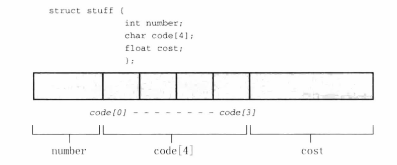
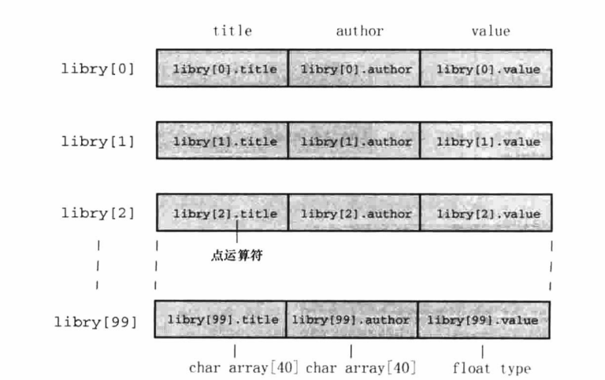
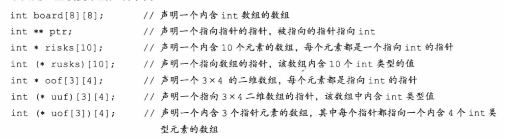
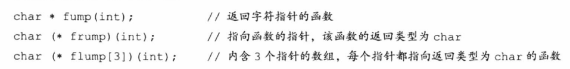
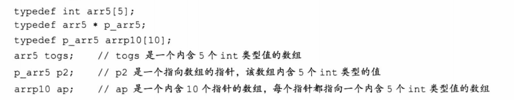

# C Primer Plus Chapter 14

结构和其他数据形式

<!-- TOC -->

- [C Primer Plus Chapter 14](#c-primer-plus-chapter-14)
    - [建立结构声明](#%E5%BB%BA%E7%AB%8B%E7%BB%93%E6%9E%84%E5%A3%B0%E6%98%8E)
    - [定义结构变量](#%E5%AE%9A%E4%B9%89%E7%BB%93%E6%9E%84%E5%8F%98%E9%87%8F)
        - [初始化结构](#%E5%88%9D%E5%A7%8B%E5%8C%96%E7%BB%93%E6%9E%84)
    - [结构数组](#%E7%BB%93%E6%9E%84%E6%95%B0%E7%BB%84)
        - [声明结构数组](#%E5%A3%B0%E6%98%8E%E7%BB%93%E6%9E%84%E6%95%B0%E7%BB%84)
    - [嵌套结构](#%E5%B5%8C%E5%A5%97%E7%BB%93%E6%9E%84)
        - [指向结构的指针](#%E6%8C%87%E5%90%91%E7%BB%93%E6%9E%84%E7%9A%84%E6%8C%87%E9%92%88)
        - [用指针访问成员](#%E7%94%A8%E6%8C%87%E9%92%88%E8%AE%BF%E9%97%AE%E6%88%90%E5%91%98)
    - [向函数传递结构的信息](#%E5%90%91%E5%87%BD%E6%95%B0%E4%BC%A0%E9%80%92%E7%BB%93%E6%9E%84%E7%9A%84%E4%BF%A1%E6%81%AF)
        - [传递结构的地址](#%E4%BC%A0%E9%80%92%E7%BB%93%E6%9E%84%E7%9A%84%E5%9C%B0%E5%9D%80)
        - [其他结构特性](#%E5%85%B6%E4%BB%96%E7%BB%93%E6%9E%84%E7%89%B9%E6%80%A7)
        - [结构中的字符数组和字符指针](#%E7%BB%93%E6%9E%84%E4%B8%AD%E7%9A%84%E5%AD%97%E7%AC%A6%E6%95%B0%E7%BB%84%E5%92%8C%E5%AD%97%E7%AC%A6%E6%8C%87%E9%92%88)
        - [复合字面量和结构](#%E5%A4%8D%E5%90%88%E5%AD%97%E9%9D%A2%E9%87%8F%E5%92%8C%E7%BB%93%E6%9E%84)
        - [伸缩型数组成员（C99）](#%E4%BC%B8%E7%BC%A9%E5%9E%8B%E6%95%B0%E7%BB%84%E6%88%90%E5%91%98c99)
        - [匿名结构（C11）](#%E5%8C%BF%E5%90%8D%E7%BB%93%E6%9E%84c11)
        - [使用结构数组的函数](#%E4%BD%BF%E7%94%A8%E7%BB%93%E6%9E%84%E6%95%B0%E7%BB%84%E7%9A%84%E5%87%BD%E6%95%B0)
    - [把结构保存在文件中](#%E6%8A%8A%E7%BB%93%E6%9E%84%E4%BF%9D%E5%AD%98%E5%9C%A8%E6%96%87%E4%BB%B6%E4%B8%AD)
    - [联合简介](#%E8%81%94%E5%90%88%E7%AE%80%E4%BB%8B)
        - [匿名联合](#%E5%8C%BF%E5%90%8D%E8%81%94%E5%90%88)
    - [枚举类型](#%E6%9E%9A%E4%B8%BE%E7%B1%BB%E5%9E%8B)
    - [typedef](#typedef)
    - [复杂声明](#%E5%A4%8D%E6%9D%82%E5%A3%B0%E6%98%8E)
    - [函数和指针](#%E5%87%BD%E6%95%B0%E5%92%8C%E6%8C%87%E9%92%88)

<!-- /TOC -->

## 建立结构声明

结构声明(*structure declaration*)描述了一个结构的组织布局。声明类似如下：

```c
struct book{
    char title[MAXTITL];
    char author[MAXAUTL];
    float value;
};
```

关键字struct表示跟在其后的是一个结构，book是一个可选的标记（在一处定义结构布局，在另一处定义实际结构变量必须使用标记），使使用时可以这样声明：

```c
struct book library;
struct book * ptbook;
```

在结构声明中，成员可以是任意一种C的数据类型，甚至可以是其他结构。注意右花括号后面的分号是必须的。

## 定义结构变量

一个结构的内存分配如下：



就计算机而言，下面的声明是再下面声明的简化：

```c
struct book library;
struct book {
    char title[MAXTITL];
    char author[MAXAUTL];
    float value;
} library;
```

若声明结构和定义结构在一处，则此处的book标记可省略。

### 初始化结构

- 定义时赋值

    ```c
    struct book library = {
        "The Pious Pirate and the Devious Damsel",
        "Renee Vivotte",
        1.95
    };
    ```

- 定义后逐个赋值

    ```c
    library.title = "The Pious Pirate and the Devious Damsel";
    library.author = "Renee Vivotte";
    library.value = 1.95;
    ```

    例如library.value就是一个float型变量，不是指针哦。

- 定义时乱序赋值

    ```c
    struct book library = {
        .value = 1.95,
        .title = "The Pious Pirate and the Devious Damsel",
        .author = "Renee Vivotte"
    };
    
    ```

    这里是可以缺项的，即比如大括号里只初始化一项。

- 特殊

    ```c
    struct book library = {
        .value = 1.95,
        .author = "Renee Vivotte",
        0.25
    };
    ```

    赋给value的值是0.25，因为在结构声明中它紧跟着author成员后，新值取代了旧值。

## 结构数组

其他值得注意：

结构与内存：若声明了一个过大的数组，因数组是自动存储类别的对象，被存储在栈中，可能会导致溢出。要修正这个问题，可以修改编译器设置使栈的大小变大，或使用静态或外部数组（这样就不存储在栈中），或声明一个较小的数组。

### 声明结构数组

- 声明结构数组

    ```c
    struct book library[MAXBKS];
    ```

    

- 标识结构数组的成员

```c
library             // 一个book结构的数组
library[2]          // 一个数组元素，该元素是book结构
library[2].title    // 一个char数组（library[2]的title成员）
library[2].title[4] // 数组中library[2]元素的title成员的一个字符
```

## 嵌套结构

```c
struct names {
    char first[LEN];
    char last[LEN];
};

struct guy {
    struct names handle;            // 嵌套结构
    char favfood[LEN];
    char job[LEN];
    float income;
};

printf("%s", fellow.handle.first);  // 访问
```

### 指向结构的指针

对函数传递指针更有效率

与数组不同的是，结构名不是结构的地址，故指针赋值时要加上&运算符。在本例中，fellow是一个结构数组，即fellow[0]是一个结构，故赋值如下：

```c
struct guy * him;

him = &barney;
him = fellow[0];
```

如果此时输出him+1的地址，应是地址加上整个结构体占用内存大小。（有时候甚至比他大，因为有的系统把所有成员放在偶数地址上等）。

### 用指针访问成员

有两种方法：

- 使用->访问指针指向的结构的成员

    him->income 即为 barney.income 或 fellow[0].income

- 使用 * 运算符

    (*him).income == him->income

## 向函数传递结构的信息

### 传递结构的地址

例如：

```c
double sum(const struct funds * money)
{
    return(money->bankfund + money->savefund);
}

sum(&stan)  // 使用时
```

可以直接传结构/返回结构，但是偏慢，且函数处理的是结构的备份而非本身，不要这样做。

传递结构的好处是可以保护原始数据（因为都是备份再处理），小型同类型结构直接传递结构更自然。传递指针方案可使用const以保护原始数据。

### 其他结构特性

允许将一个结构赋值给另一个结构，允许使用一个结构对另一个结构初始化。（不像数组，数组是不允许的）。

```c
o_data = n_data;    // 把结构赋值给另一个结构

struct names right_field = {"Ruthie", "George"};
struct names captain = right_fiedl; // 把一个结构初始化为另一个结构
```

### 结构中的字符数组和字符指针

在结构中使用字符指针存储将具有潜在的危险：

```c
struct pnames{
    char * first;
    char * last;
}

puts("Enter the last name of your attorney:");
scanf("%s", attorney.last);     // 使用例（具有潜在危险！）
```

字符串指针未初始化，可能存储在任何位置，直接使用可能造成程序崩溃。

使用malloc优化：

```c
struct namect{
    char * fname;
    char * lname;
    int letters;
}

void getinfo (struct namect * pst)
{
    char temp[SLEN];
    printf("Please enter your first name.\n");
    s_gets(temp, SLEN);

    pst->fname = (char *)malloc(strlen(temp) + 1);  // last name同理
    strcpy(pst->fname, temp);

    // 程序结束后可用clean将内存释放。
}
```

### 复合字面量和结构

```c
(type name) {initializer-list}

(struct book) {"The Idiot", "Fyodor Dostoyevsky", 6.99}
(int[]) {1, 2, 3}
```

相比数组，因结构可以直接被结构初始化，故可直接赋给结构。

### 伸缩型数组成员（C99）

声明一个伸缩型数组成员的规则是：

- 伸缩型数组必须是结构最后一个成员
- 结构中必须至少有一个成员
- 声明类似于普通数组，但括号内是空的

```c
struct flex
{
    int count;
    double average;
    double scores[];    // 伸缩型数组成员
}
```

实际上，你应该声明struct flex类型的指针而不是这个类型本身（为了使用malloc）。

```c
struct flex * pf;   // 声明一个指针
// 重要：请求为一个结构和一个数组分配存储空间
pf = malloc(sizeof(struct flex) + 5 * sizeof(double));
```

此种结构不能给其他结构赋值。此种结构不要作为其他结构中嵌套的结构。

### 匿名结构（C11）

一个嵌套结构示例如下：

```c
struct names
{
    char first[20];
    char last[20];
};
struct person
{
    int id;
    struct names name;  // 嵌套结构成员
};

struct person ted = {8483,{"Ted", "Grass"}};    // 初始化方式

puts(ted.name.first);   // 访问方式
```

C11中可以使用匿名成员进行嵌套：

```c
struct person
{
    int id;
    struct {char first[20]; char last[20];};    // 匿名结构
};

struct person ted = {8483,{"Ted", "Grass"}};    // 初始化方式（与非匿名相同）

puts(ted.first);   // 访问方式
```

### 使用结构数组的函数

对结构而言，其名称不是自己的地址，使用时必须加&，但结构数组（含多个结构）是数组，其名字即为首地址，也即第一个结构的地址。

例如：struct funds jones[N]     // 一个财务管理结构

jones = &jones[0]

可以在函数传递时使用jones！

## 把结构保存在文件中

存储在一个结构中的整套信息被称为记录(*record*)，单独的项被称为字段(*field*)。

```c
while (count < MAXBKS && fread(&library[count], sizeof(struct book), 1, pbooks) == 1)
{
    printf("%s by %s: $%.2f\n", library[count].title, library[count].author, library[count].value);
    count ++;
}
```

fread&fwrite是按块写入/读取的函数，需要文本用二进制模式打开。若一开始数据就是按固定大小存储的，则用这种方式可以进行检索。

但是，这样的方式会浪费很多空间，许多数据本不需要那么大的存储空间。你需要学习：数据结构，以解决此问题。

## 联合简介

**联合**（*union*）是一种数据类型，能在一个内存空间中存储不同数据类型。其典型用法是设计一种表以存储既无规律、事先也不知道顺序的混合类型。

声明如下：

```c
union hold {
    int digit;
    double bigfl;
    char letter;
};
```

此形式表示：它可以存储int和double和char类型。但，在实际声明时，联合只能存储一个int或一个double或一个char。

```c
union hold fit;         // 声明联合变量
union hold save[10];    // 内含10个联合变量的数组
union hold * pu;        // 指向hold类型联合变量的指针
```

在前两个声明中，编译器会分配所有可能中最大的空间（此例中是double，占8字节）。而数组则是占80个字节。

初始化方法：

```c
union hold valA;
valA.letter = 'R';
union hold valB = valA;    // 用另一个相同结构的联合初始化
union hold valC = {88};    // 初始化成员
union hold valD = {.bigfl = 118.2}; // 指定初始化

fit.digit = 23;     // 联合永远只有一个状态！
fit.bigfl = 2.0;    // 清除23，存储2.0
fit.letter = 'h';   // 清除2.0，存储h
```

### 匿名联合

一个存储车辆信息的程序示例如下：

```c
struct owner {              // 存储私家车信息的结构
    char socsecurity[12];
    ...
}

struct leasecompany {       // 存储租赁车公司信息的结构
    char name[40];
    char headquarters[40];
    ...
}

struct car_data {
    char make[15];
    int status;     // 表征是私有还是租赁
    union {         // 此处使用了匿名结构！
        struct owner owncar;
        struct leasecompany leasecar;
    };
    ...
}
```

- union的好处：适合于这种“虽然此时并不知道属于哪一类，但是该物品的属性有且仅有一类”
- union后没有结构名，使得访问时可直接：flits.owncar.socsecurity而不用再加一层union的名字。

## 枚举类型

可以用枚举类型(*enumerated type*)声明符号名称来表示整型常量（必须是int型）。

```c
enum spectrum {red, orange, yellow, green, blue, violet};   // red,orange等为枚举符enumerator
enum spectrum color;

color = blue;       // 使用
if (color == yellow)
    ...
```

red，yellow到底是什么？如果你去printf它，就会发现其实是0，2。因此，枚举符就是一个有名称的常量。在switch语句中，常用枚举常量作标签。

其枚举符默认从0开始排，但你若对他进行赋值：

```c
enum spectrum {red, orange = 10, yellow, green, blue, violet};
```

若有缺项，则red为0，orange为10，yellow为11，green为12...

## typedef

为经常出现的类型创建一个方便、易识别的类型名。和#define不同的是它右边才是新名称。

```c
typedef char * STRING;

typedef struct complex {    // 可省略complex标签
    float real;
    float imag;
}COMPLEX;       // 就可以使用COMPLEX来创建新复数了
```

但千万别用#define来实现这种操作。

```c
STRING name, sign;
相当于： char * name, * sign;

但若是： #define STRING char *
STRING name, sign;
则相当于: char * name, sign;
```

## 复杂声明





## 函数和指针

函数指针常用作另一个函数的参数，告诉该函数要使用哪个一个函数（例如排序算法有很多种方式）。

函数的指针指向存储着函数代码起始处的地址。

示例如下：

```c
void ToUpper(char *);   // 小写转换为大写函数

void (*pf)(char *);     
// 指向一个“接收char*为变量，无返回值的函数”的指针
// 注意一定不要忘记*pf的括号，否则会从右向左组合

pf = ToUpper;       // 正确的赋值
pf = ToLower;       // 正确的赋值
pf = round;         // 错误，类型不匹配
pf = ToLower();     // 错误，这不是地址！

(*pf)(mis);    // 相当于ToUpper(mis) (mis为某字符串)
pf(mis);       // 同样也正确！因为函数名即为指针
// （由于一些历史原因）这两种都是可以的，但是我觉得用第一种吧
```
