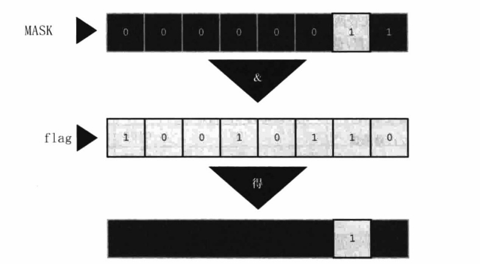

<!--
 * @Date: 2023-03-29
 * @LastEditors: Wakasagihime
 * @LastEditTime: 2023-03-30
 * @FilePath: \\C_Projectd:\\code\\c\\blog\\CPrimerPlusChapter15.md
 * @Description: 
-->
# C Primer Plus Chapter 15

位操作

## 二进制数、位和字节

**二进制补码**（*two's-complement*）：

以8位为例，为省去减法，使 2-1 = 2 + (-1) = 2 + (255 - 256)

256为进位自然消去，255为-1。故看见补码，想知道其数值，用它减去进位值（此处为256）即可得其原数。

## C按位运算符

取反~，按位与&，按位或|

按位异或^：有一个为1，且不同时为1时，结果为真。

用法：

- 掩码：其他位置0，仅某位可见，使用&。

    

- 置位：使某位为1，其他位不变，使用|。
- 清空位：flag & ~mask
- 切换位：flag ^ mask

    mask为1的位，将切换flag位（若该位为1，则变为0，0则变1）；

    mask为0位则保持不动。

左移&右移：

注意：右移对于有符号类型，左端是填充1还是0取决于机器，无符号则固定为用0填充。

典型用法：

```c
#define BYTE_MASK 0xff
unsigned long color = 0x002a162f;
unsigned char blue, green, red;
red = color & BYTE_MASK;
green = (color >> 8) & BYTE_MASK;
blue = (color >> 16) & BYTE_MASK;
```

## 位字段

参考文章：
<https://blog.csdn.net/leasonw/article/details/80098797>

```c
struct {
    unsigned int autfd : 1;
    unsigned int bldfc : 1;
    unsigned int undln : 1;
    unsigned int itals : 1;
}prnt;
```

注意，prnt本身是一个unsigned或signed int，占的总字节数是4个（一般情况）。

```c
struct {
    unsigned int code1 : 1;
    unsigned int code2 : 1;
    unsigned int code3 : 1;
}prcode;

prcode.code1 = 0;       // 赋值
prcode.code2 = 3;
prcode.code3 = 102;
```

- 单段字段位数超过32将直接报错
- 赋值时超过其位数将被直接截断

```c
struct {
    unsigned int code1 : 31;
    unsigned int code2 : 3;
}prcode;

```

- 多段字段加起来超过32将被强制对齐，此处code2段将从下一个32位开始，而不是连在code1后。这使得中间将会产生空隙

```c
struct {
    unsigned int field1 : 1;
    unsigned int        : 2;    // 这两位被空为0
    unsigned int field2 : 1;
    unsigned int        : 0;    // 将强制下一个字段（field3从新的unsigned int开始存）
    unsigned int field3 : 1;
}stuff;

```

字段存储顺序（从左往右还是从右往左）等取决于机器，不同机器字段边界位置也不同，故通常不易移植。

## 对齐特性（C11）

```c
_Alignof(double) char c1;   // 使char按8字节对齐，地址可被8整除
```

注意：不能要求其对齐值小于默认值（默认值就是它自己本身的大小）。
