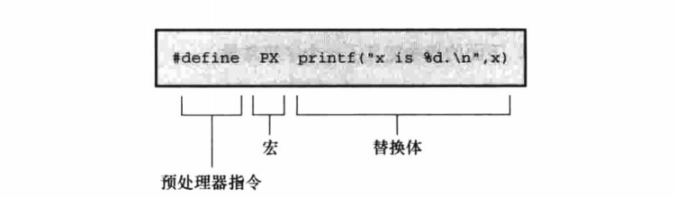
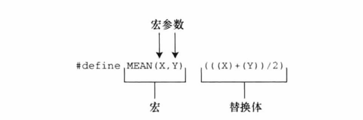
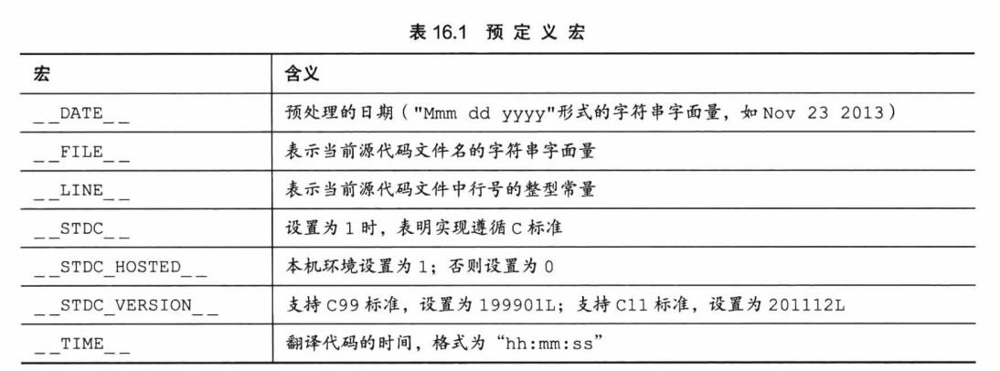
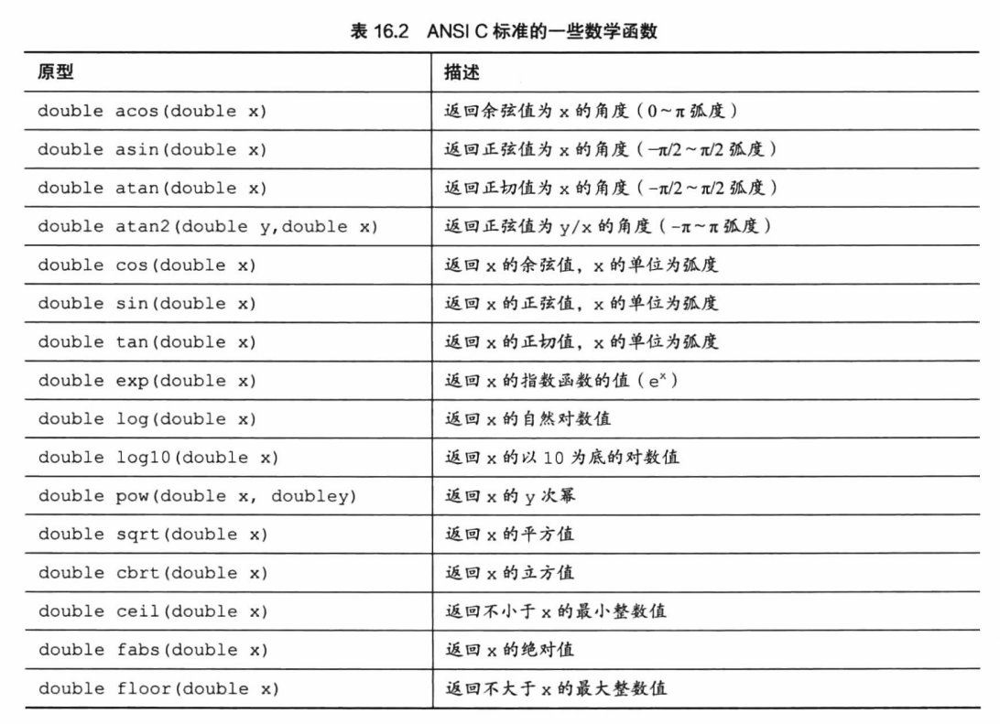

# C Primer Plus Chapter 16

C预处理器和C库

## 翻译程序的第一步

- 编译器将源代码中出现的字符映射到源字符集（有些扩展的）。
- 将物理换行删除变成逻辑行，例如：

    ```c
    printf("That's wond\
    erful!");       // 注意，第二行开始要和这个语句的开始对齐（按下回车后编译器自动对齐到那里），打tab等会导致字符串中出现此tab
    ```

- 将文本划分为预处理记号序列（空格、制表符或换行符分隔的项），空白序列（一个空格替换）和注释序列（将用一个空格替换掉所有注释）。

## 明示常量 #define

对代码进行宏展开。



注意：define常量可用于const类型初始化，而const不行。（C不行，C++行）

```c
#define LIMIT 20
const int LIM = 50;
static int data1[LIMIT];    // 有效
static int data2[LIM];      // 无效
const int LIM2 = 2 * LIMIT  // 有效
const int LIM3 = 2 * LIM    // 无效
```

## 在 #define 中使用参数



注意优先级！陷阱：

```c
#define SQUARE(X) X*X

SQUARE(x+2);    // 该式等于 x+2*x+2
应:
#define SQUARE(X) (X)*(X) 

100/SQUARE(2);  // 该式等于 100/2*2 = 100
应：
#define SQUARE(X) (X*X) 
即：
#define SQUARE(X) ((X)*(X)) 
```

### 用宏参数创建字符串：#运算符

C允许在字符串中包含宏参数，可以使用#使宏参数转换成一个字符串，这个过程叫**字符串化**（*stringizing*）

```c
#define PSQR(x) printf("The square of" #x " is %d.\n", ((x)*(x)))

int main()
{
    int y = 5;

    PSQR(y);
    PSQR(2 + 4);

    return 0;
}
```

输出为：

The square of y is 25.

The square of 2 + 4 is 36.

### 预处理器粘合剂：##运算符

\#\#运算符可以使左右两边两个记号合并成一个记号。

```c
#define XNAME(n) x ## n
#define PRINT_XN(n) printf("x" #n " = %d\n", x ## n);

int main()
{
    int XNAME(1) = 14;  // 变成 int x1 = 14;
    int XNAME(2) = 20;  // 变成 int x2 = 20;
    int x3 = 30;
    PRINT_XN(1)；       // 变成printf（"x1 = %d\n", x1);
    PRINT_XN(2)；       // 变成printf（"x2 = %d\n", x2);
    PRINT_XN(3)；       // 变成printf（"x3 = %d\n", x3);

    return 0;
}
```

### 变参宏：...和__VA_ARGS__

...表明省略的参数，\_\_VA_ARGS__表明省略的参数用在哪里。

\#define PR(...) printf(\_\_VA_ARGS__)

调用PR("weight = %d, shipping = %.2f\n", wt, sp); 将变成：printf("weight = %d, shipping = %.2f\n", wt, sp);

注意：省略号只能代替最后的宏参数，不允许：

\#define WRONG(X, ..., Y) #X #__VA_ARGS\_\_ #y

## 宏和函数的选择

对于宏而言，调用20次即在程序中插入20行此代码，但是函数则只有一份，节省了空间。

另一方面，程序控制必须跳转至函数内，再返回主调程序，比内联代码花费更多时间。

一般对于简单函数使用宏函数。

## 文件包含：#include

- 明示常量：如EOF、NULL等
- 宏函数
- 函数声明
- 结构模板定义
- 类型定义：size_t、time_t等typedef

## 其他指令

- #undef用于取消已定义的#define：有时想使用一个名称（在宏里用），又不确定之前是否已经用过，为安全起见可以用#undef
- \#ifdef、#else和#endif

    ```c
    #ifdef MAVIS
        #include "horse.h"
        #define STABLES 5
    #else
        #include "cow.h"
        #define STABLES 15
    #endif
    ```

    #endif必须和#if配对

- \#ifndef

    \#ifndef用法类似。常在头文件定义时使用（包含同一个头文件两次程序将无法通过编译）：

    ```c
    #ifndef THINGS_H_
    #define THINGS_H_
    /* 头文件内容 */
    #endif
    ```

- \#if 和 \#elif

    ```c
    #if SYS == 1
        #include "ibmpc.h"
    #elif SYS == 2
        #include "vax.h"
    #elif SYS == 3
        #inclue "mac.h"
    #else
        #include "general.h"
    #endif
    ```

    较新的编译器可以使用#if defined (...)来代替#ifdef，这样也可在if else中使用。

    ```c
    #if defined (IBMPC)
        #include "ibmpc.h"
    ...
    ```

- 预定义宏

    

    此外，C99增加了__func__，将展开为当前函数名的字符串。

- #line 和 #error

    ```c
    #line 1000          // 把当前行号重置为1000
    #line 10 "cool.c"   // 把行号重置为10，并重命名文件

    #if __STDC_VERSION__ != 201112L // error示例，用于输出错误信息
    #error Not C11

    #endif
    ```

- #pragma 略
- 泛型选择

    ```c
    #define MYTYPE(x) _Generic((x),\
    int: "int",\
    float: "float",\
    double: "double"\
    default: "other")

    int main()
    {
        int d = 5;

        printf("%s\n", MYTYPE(d)); // int
        printf("%s\n", MYTYPE(2.0 * d)); // double
        printf("%s\n", MYTYPE(3L)); // long
        printf("%s\n", MYTYPE(&d)); // int *
    }

    输出为：
    int
    double
    other
    other
    ```

## 内联函数、_Noreturn函数（略）

## 数学库


