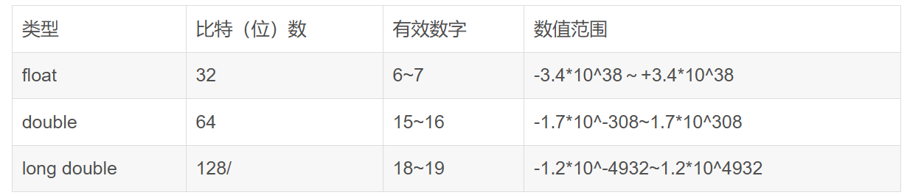

# C Primer Plus Chapter 2/3

C语言概述学习记录及疑问

## 个人注意的点

1. 操作系统和C库经常使用以一个或两个下划线字符开始的标识符，避免在自己的程序中使用这种名称。
2. C语言区分大小写。
3. return 0 算是一种规范啦。
4. 浮点数在计算机内部使用二进制和2的幂次进行存储。
5. 64位计算机int和long int无区别了，都是32位。int是不确定位数的，只是最低16位。故常用int32_t，int16_t这种形式。
6. short类型使用h前缀，例如%hd。short、long将对超过位数的数进行截断。
7. char类型根据ASCII存储整数，范围为0~127，故char定义为占用1字节存储空间。
8. char类型为有符号还是无符号根据编译器不同而不同。可查阅limits.h头文件。且C90标准允许在关机键字char前使用signed或unsigned。(GCC是-128~127)
9. 头文件stdint.h提供int32_t等类型。int_least8_t是若系统不支持int8_t，则它是可容纳8位int的宽度最小的类型。int_fast8_t是对于8位int运算最快的整数类型。
10. 浮点数定义可省略小数点或整数，比如3.E16、.45E-6。不要在E前加空格。
11. 系统默认带小数的数采用double，可用F/f后缀得float（比如2.0f），L得long double（小写易混为1，建议大写）。%f打印浮点，%e打印指数记法。
12. 浮点数上溢将得到inf结果，和整数不同！浮点数下溢指计算过程损失了原末尾有效数字，比如本只有4位有效数字0.1234E-10除以10，指数已经不可以再除以10了，结果变成了0.0123E-10，损失了4（二进制同理）。若除以一个非常大的数，则每一位都会变为0，这就是下溢。
13. 特殊浮点值NaN(not a number)。如计算arcsin输入数值大于1，gcc将显示nan(ind)
14. 在引入了complex.h头文件后，可以使用complex定义复数。同时还可定义complex float、complex double等。幅值方法为：z = a + bi。（不引入头文件需使用double_Complex,double_Imaginary。)
15. 用%d输出float，是不会给你截断/转化的，会直接出错。
16. printf()首先把输出发送到缓冲区(buffer)，当缓冲区满、遇到换行字符或需要输入的时候才会将printf发送到屏幕。
17. 八进制、十六进制只作为无符号整数使用(unsigned int)。

## 一些表格

转义序列表

int类型写法

float和double位数问题

float：8位指数与符号，24位尾数，共32位。至少6位有效数字。

double：不同系统将多余的32位分配给指数还是尾数不太一样，精度也不太一样，至少10位有效数字。

long double：只保证至少比double精度高。

表格看看就可以，引自<https://blog.csdn.net/KLFTESPACE/article/details/81150481>

## 浮点数舍入错误

例子如下：

**分析：**

- 二进制小数转换
  
  - 二进制转十进制：$a \times \frac 1 2 + b \times \frac 1 4 + c \times \frac 1 8 \cdots$
  - 十进制转二进制：原数乘2，若结果大于1，则小数第一位为1，反之为0；原数乘4，结果若结果大于1，则小数第一位为1，反之为0…

- 2e20的二进制表示

    $2e20/2^{67}$余数为1.35525（十进制）。

    2e20在二进制存储下为1.010110101111000111010111 * 2^1000011，指数位存储1000011和正符号，小数位存储24位二进制尾数。

    将1.010110101111000111010111 * 2^1000011转换回整数约为1.9999999521e20可知超过6位后数字已无效。二进制指数加减法过程较为复杂，不作讨论。

## 疑问

1. printf的实现：对指针部分不熟，刚开始看就蒙了，以后再看。
2. inttypes.h定义了PRId32字符串宏，用于代替%d保证打印位数为32位有符号。但是不一定所有编译器支持此头文件。所以好像对增加可移植性没有什么裨益……
