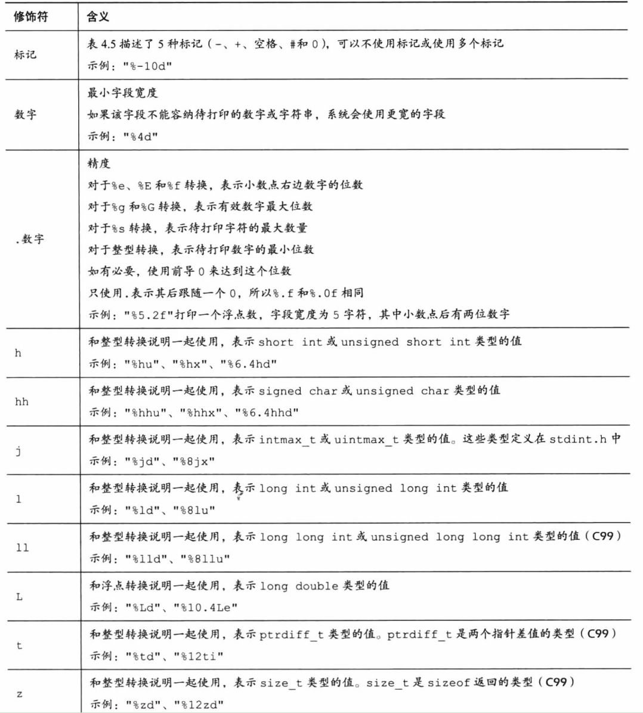

# C Primer Plus Chapter 4

字符串和格式化输入输出学习笔记

## 个人注意的点

1. 实际字符串长度为存储字符+1（因有标志结束的空字符）。

2. scanf()在遇到第一个空白（空格、制表符或换行符）时就不再读取输入。
3. %zd输出格式是为size_t准备的，（sizeof返回值即为size_t），而size_t也就是unsigned int或unsigned long。
4. strlen()是不包括最后空字符的。sizeof()是数组真实长度。
5. define定义的常理大写是c语言习惯。
6. const声明的是变量，但是在程序中不可改变。
7. 例子中还有65618存储为short int，若余数在32767~65536中，则会打印出负数。

8. 混淆整型和浮点数将产生毫无意义的的数（因为位数不同，所以会随便填进去一些数）。
9. printf()若前面转换格式错误，后面即使正确也有可能产生错误的结果。比如此处前面本应当是8字节的数，作为4字节输出了，printf在栈中依次取值，故即使后面转换格式正确，也并未得到正确结果。

10. printf其实有返回值，返回打印了几个字符，不过很少用。若出现错误则返回负值。vscode好像是直接停止在那一句。
11. printf中字符串换行方式：
    1. 使用多个printf；
    2. 使用反斜杠和Enter组合键，但下一行必须顶头写（不好使）；
    3. 使用printf("a""b"(换行)"c")链接字符串。
12. scanf若输入格式为%i，则遇到前缀为0会自动识别为8进制，0x会识别为16进制。
13. 修饰符*：在printf中可用于变宽，如printf("Weight = &*.*f\n", width, precision, weight);在scanf中用于跳过，如scanf("%*d %*d %d", &n);指跳过前两个整数。

## printf使用

printf输出格式：

[标志] [输出最小宽度] [.精度] [长度]

"-"：左对齐，比如输出宽度为6，实际只有2个字符，则会xx空空空空。

"+"：右对齐。默认即为右对齐。不写+同样也会显示负号的。

空格：有符号若为正，则显示空格；若为负则显示负号，覆盖掉空格。

对整数"%m.nd"：m小于实际时按实际输出，小于n位前面补0。

对字符串"%m.ns"：输出m位，取字符串左起n位，右对齐，当n大于m时输出m=n。

对浮点数"%m.nf"：m为宽度，n为小数点几位。此小数点非截断，会有进位。

如果加入前导0，则输出不足位时前面会补0。

其中z、t均是为了可移植性考虑。

## scanf使用

scanf修饰符

scanf读取字符时将跳过空白，直至第一个非空白，若此时读取的内容和设置格式不同，程序将在此停止运行。若是设置为字符串输入，则scanf将自动添加\0。

除%c外，其余格式限制中的空格都意味着跳过所有空白（包括没有空格的特殊情况），而%c则要求严格符合格式。

scanf的返回值是成功读取的项数，若未读取任何项返回0。若检测到“文件结尾”返回EOF（通常用#define定义为-1）。

一个典型scanf读取示例：

