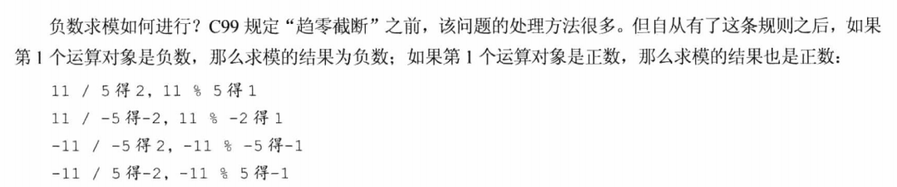
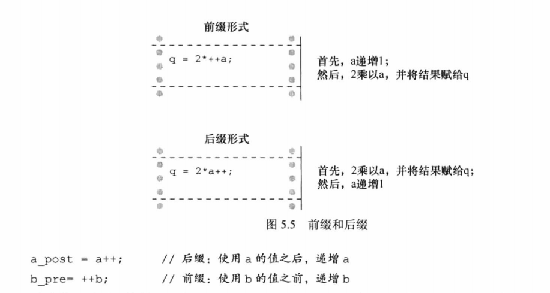
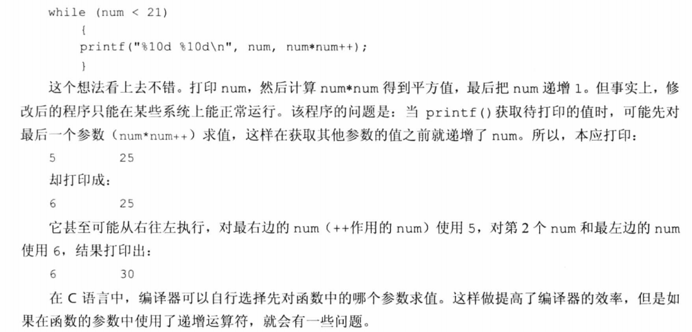

# C Primer Plus Chapter 5

运算符、表达式和语句

## 个人注意的点

1. 两整数相除所得结果将截断（无四舍五入）小数部分。C99规定采用趋0截断，即-3.9将被截断为-3而非-4。整数、浮点数混合相除将得到浮点数。
2. 优先级：乘除大于加减，同优先级从左到右。
3. 求模运算只适用于整数。
4. 负数求模规则：

5. 递增：前缀为增完后运算，后缀为使用当前值后递增。

6. 递增减优先级很高，大于乘除，小于括号，且只能作用于一个变量，如$x*y++$并非为$(x*y)++$。注意：优先级是一回事，后缀递增减为运算后再增减是另一回事，不要混淆为必须先加减。
7. 不要自作聪明。如果一个变量出现在一个函数的多个参数中，不要使用递增减运算符。如果一个变量多次出现在一个表达式中，不要对该变量使用递增减运算符。你无法保证编译器先运算的哪个。

8. 所有表达式都有一个值。如6+(c=3+8)值为17，赋值表达式的值和左侧变量值相同（不过不建议使用）。如5>3表达式值为1。
9. 浮点型向整型降级将直接截断。升级一般没事，降级应尤为注意。

## 副作用和序列点

**副作用**是对数据或文件的修改。例如语句states=50；将变量值设为50是副作用，求这个表达式本身的值才是目的。同理，调用printf函数时，显示信息为副作用，返回待显示字符个数是目的。

**序列点**是程序执行的点，在该点上，所有副作用都在进入下一步之前发生。

**完整表达式**是指这个表达式不是一个更大的表达式的子表达式。

如：

``` c
while(guests++ < 10)
    printf("%d\n", guests);
```

表达式guests++ < 10已是完整表达式，是while循环的测试条件，该表达式结束就是一个序列点。因此guests在printf前要完成递增。

而：

```c
y = (4 + x++) + (6 + x++);
```

因为4 + x++不是完整表达式，无法保证在子表达式求值后立刻递增x，因此本式只能保证下一条语句前x递增两次，但无法保证y所得结果。
