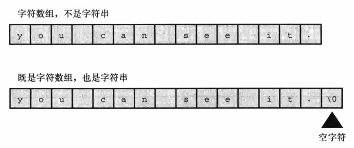
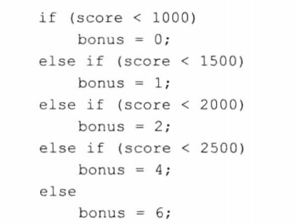
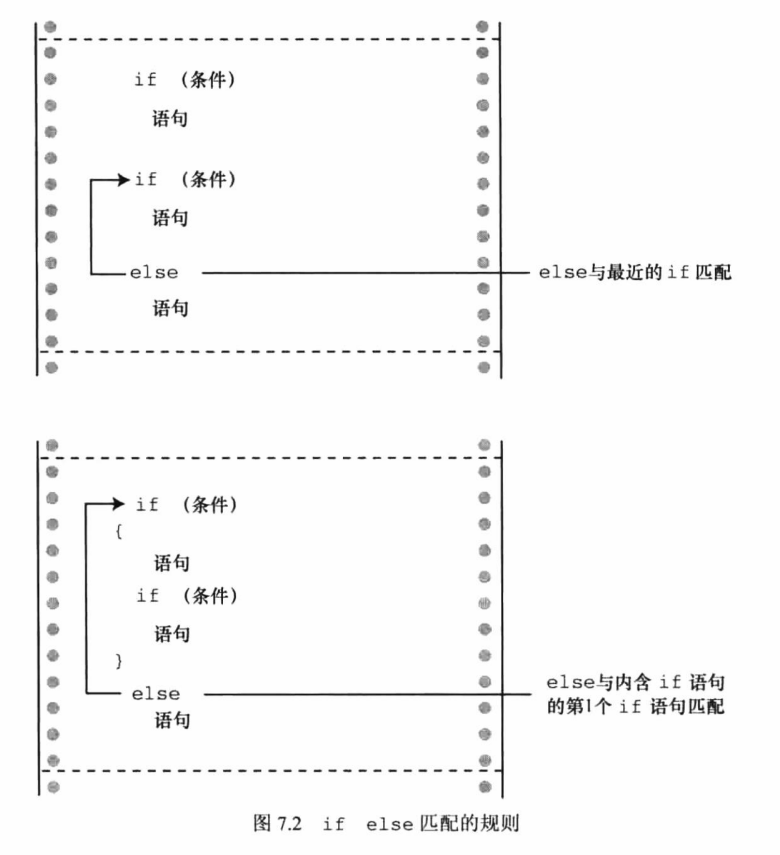
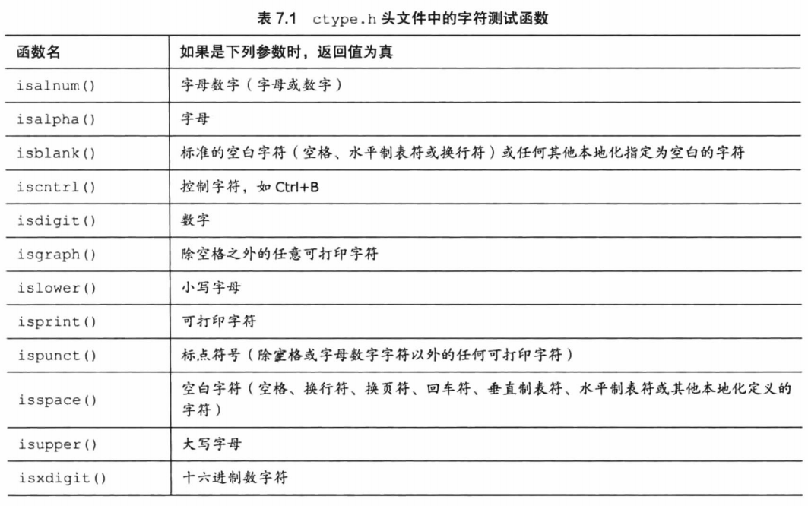
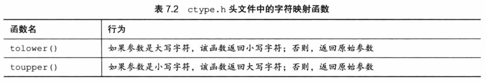
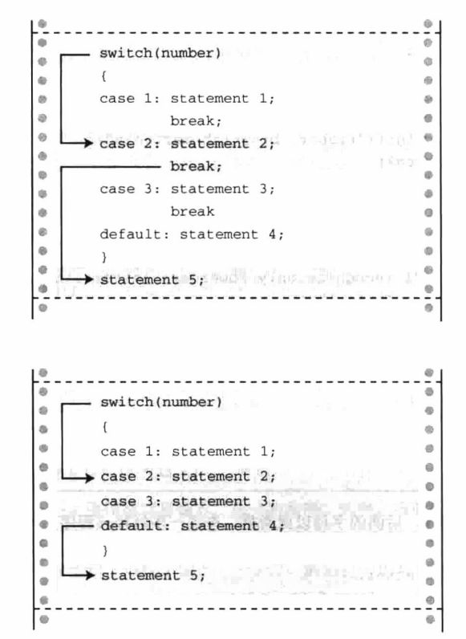

<!--
 * @Date: 2023-02-07
 * @LastEditors: Wakasagihime
 * @LastEditTime: 2023-02-21
 * @FilePath: \c\blog\CPrimerPlusChapter6&7.md
 * @Description: 
-->
# C Primer Plus Chapter 6 & 7

## C控制语句：循环

1. 浮点数比较大小尽量只用>和<，因为浮点数的舍入误差会导致本来相等的数不相等！如判断fabs(response - ANSWER) > 0.0001。
2. while(status = 1)，不要犯这样的错——
3. _Bool可定义布尔类型变量，所有非零值均会被设置为1。stdbool.h头文件将_Bool的别名设置为bool，支持true、false。如此可与C++兼容。
4. 关系运算符（比大小）低于+-，比赋值运算高。即x>y+2和x>(y+2)相同，x=y>2和x=(y>2)相同。运算符之间高级优先组为<<= >>=,低级优先组为== !=。
5. for循环省略判断条件视为真。第一个表达式不一定是给变量赋初值，也可以使用printf。第一个表达式只执行一次。for循环可以非常灵活，且循环体中的行为可以改变循环头中的表达式，比如for(n=1;n<10000;n=n+delta)，然后在循环中改变delta的值。
6. 逗号是一个序列点，所有副作用在序列点左侧发生。逗号表达式的值及右侧表达式的值，如houseprice=(249,500);则houseprice为500。
7. do while循环：保证循环体至少被执行一次。例如：

```c
#include <stdio.h>
int main(void)
{
    const int secret_code = 13;
    int code_entered;
    do
    {
        printf("To enter the triskaidekaphobia therapy club,\n")
        printf("please enter the secret code number: ")
        scanf("%d", &code_entered);
    }
    while(code_entered != secret_code);
    printf("Congratulations! You are cured!\n");

    return 0;
}
```

等价于：

```c
#include <stdio.h>
int main(void)
{
    const int secret_code = 13;
    int code_entered;

    printf("To enter the triskaidekaphobia therapy club,\n")
    printf("please enter the secret code number: ")
    scanf("%d", &code_entered);
    while(code_entered != secret_code)
    {
        printf("To enter the triskaidekaphobia therapy club,\n")
        printf("please enter the secret code number: ")
        scanf("%d", &code_entered);
    }
    printf("Congratulations! You are cured!\n");

    return 0;
}
```

简化了代码写法。
8. C编译器不会检查数组下标是否正确，要注意检查！且字符串与字符数组有区别：

9. C的标准风格是main()放在所有函数定义的前面，再前面是前置声明而不是函数定义（必须在main前说明函数定义在别处，返回类型为什么），函数定义放在main后或其他文件中。

## C控制语句：分支和跳转

### 个人注意的点

1. 为什么要用else if? 因为可以节省很多if中的判断语句：

2. 看如下代码：

    ```c
    if (number > 6)
        if (number < 12)
            printf("You're close!\n");
    else
        printf("Sorry, you lose a turn!\n");
    ```

    else和哪个if匹配？是第二个if！不要被缩进迷惑！
    

3. 平方根判断可以使用这种方法：(div * div) <= num
4. !优先级大于乘法，与递增相同，比圆括号低；&&优先级比||高，但二者优先级都比关系运算符低，比赋值运算符高。故a>b&&b>c||b>d等同于((a>b)&&(b>c))||(b>d)。（但使用圆括号不容易错且表达更清晰）
5. &&等均为序列点，在序列点前必完成副作用，即例如：if(number!=0 && 12/number==2)若number为0，则第一个子表达式为假，不会再对后面表达式求值；也可以写出：while((c=getchar())!=' ' && c!='\n')这样的式子，因为c的求值一定第一步会完成。
6. 为什么不能写成if(90<=range<=100)，因为这相当于(90<=range) <= 100,前一个表达式为真即为1，为假即为0，两数均小于100。

### getchar和putchar

1. getchar：从输入队列中返回下一个字符。putchar(ch)：把ch作为字符打印出来。
2. 用法示例（当输入不是换行符时）：

    ``while((ch = getchar()) != '\n')``

3. 实用函数


注意：映射不会改变参数本身的值。


## 其他个人注意的点

1. 条件运算符(?)是c语言唯一的三元运算符。我其实判断条件不写问号，但为了表达清晰还是写比较好。
2. goto应避免使用！但书中写了一个可以接受的例子如下：

```c
while (funct > 0)
{
    for (i = 1; i < 100; i++)
    {
        for (j = 1; j < 100; j++)
        {
            其他语句
            if (问题)
                goto help;
            其他语句
        }
        其他语句
    }
    其他语句
}
其他语句
help: 语句
```

为什么：因break等只能跳出一层循环，出现问题时跳出全部循环可用goto。

## continue和break

1. 执行到continue时，会跳过本次循环的剩余部分，直接开始下一轮循环。如果是嵌套循环则只影响内层循环。相比if-else格式好处是减少缩进、简洁、提高代码可读性。还有一个用法是空句改为continue会可读性更高，如

    ```c
    while(getchar() != '\n')
        ;
    ```

    改为

    ```c
    while(getchar() != '\n')
        continue;
    ```

2. continue对while和for循环的区别不要搞混，判断完for条件后还会继续执行expression3，如递增递减。
3. break：直接跳出当前循环，若有嵌套循环则只影响内层。
4. 多重选择：

    ```c
    switch(ch)
    {
        case 'a':
            /* expression */
            //注意：无需括号
            break;
        case 'b':
        case 'c':
            /* expression */
            //注意：此处b、c为多重标签，执行同样的命令。
            break;
        default:
            /* expression */
            //其实无需break但是最好写上
    }
    ```

    若标签中遗落break，则会从匹配的那一行开始一直执行到末尾。注意图中不是运行完2直接去运行default，而是把3也运行了。
    

5. switch并不算一个循环，如果在其中使用continue不会发生任何事。除非整个switch在一个循环内，则continue会跳到循环处。
6. switch注意事项：标签只可以是整形常量（包括char）,不可以是变量。
