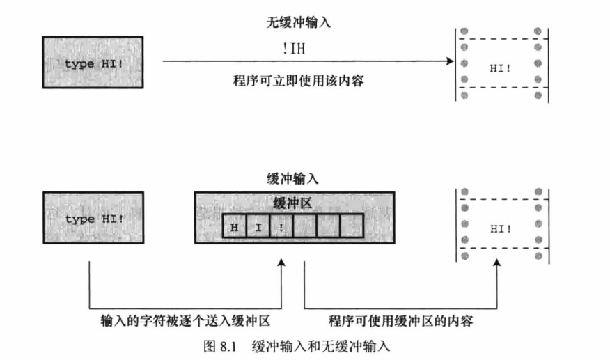
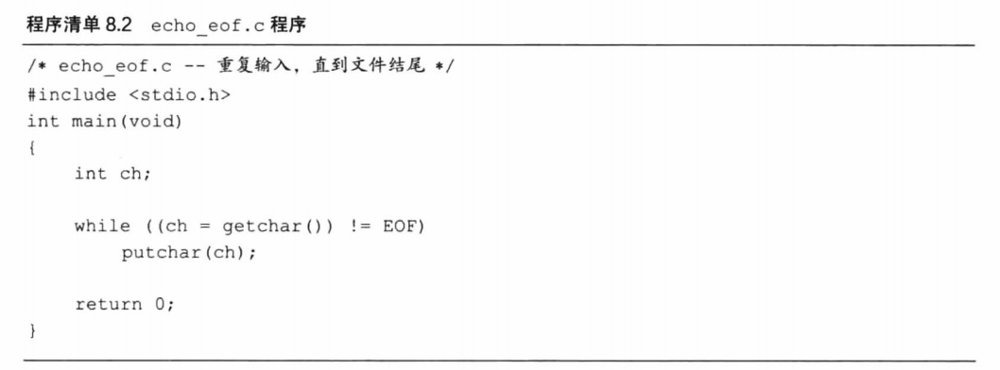
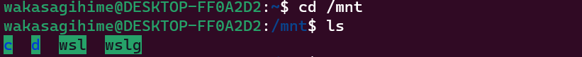
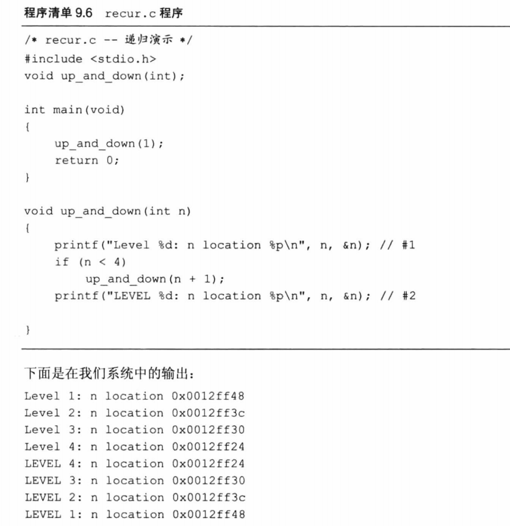
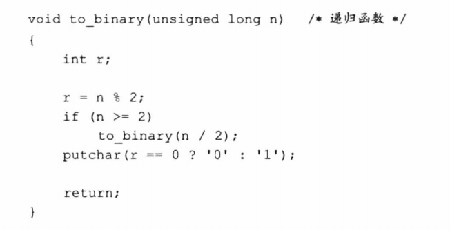
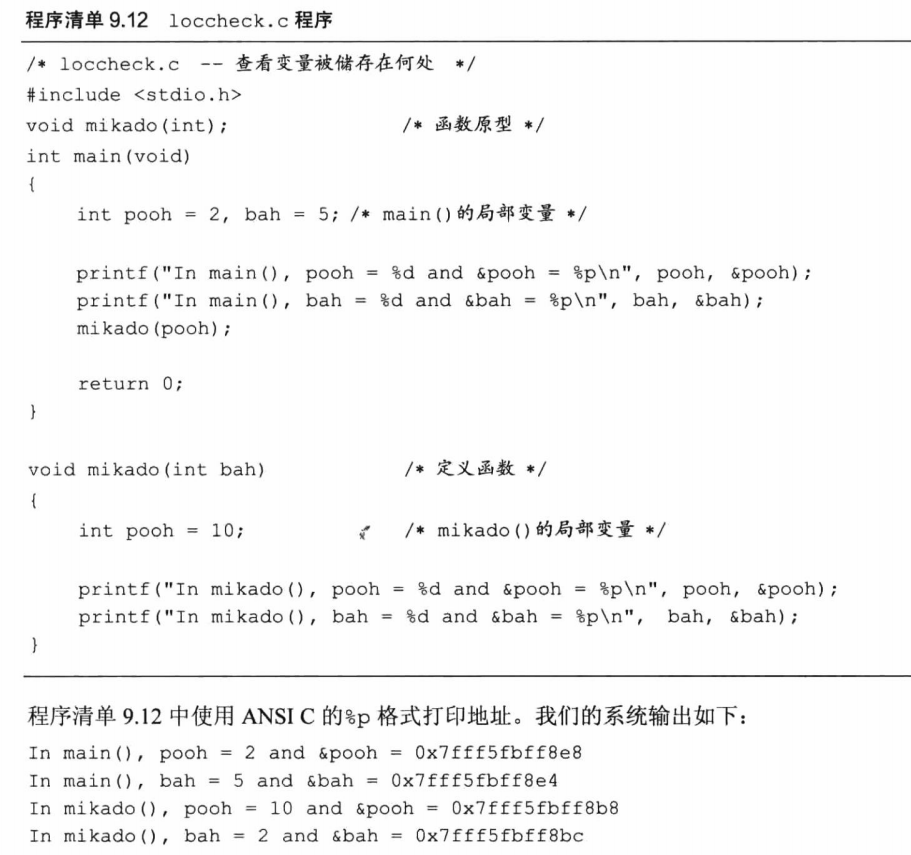

<!--
 * @Date: 2023-02-21
 * @LastEditors: Wakasagihime
 * @LastEditTime: 2023-02-24
 * @FilePath: \\pythond:\\code\\c\\blog\\CPrimerPlusChapter8and9.md
 * @Description: 
-->
# C Primer Plus Chapter 8 & 9

字符输入/输出和输入验证 & 函数

## 单字符I/O

1. 为什么要设置缓冲区：一般系统在用户按下Enter键之前不会重复打印输入的字符。若非如此，在运行程序

    ```c
    while ((ch = getchar()) != '#')
        putchar(ch);
    ```

    时，可能会得到输出：HHHIIII!!!!!
    

2. 此外，有缓冲输入在用户打错字符时可以修改错误，在按下Enter前都可以修改，而传输时的是正确的；非缓冲输入并非完全无用，比如游戏中可用无缓冲输入。
3. 缓冲分为两类：完全缓冲I/O和行缓冲I/O，完全缓冲是缓冲区填满才刷新缓冲区，通常出现在文件输入中。缓冲区大小取决于系统，常见的大小是512字节和4096字节。键盘输入通常是行缓冲输入。
4. C提供标准I/O包来处理文件，即虽然实际处理不同系统各不相同，但它自己会转换好。
5. 从概念上看，C程序处理的是流而不是直接处理文件。流(stream)是实际输入或输出映射的理想化数据流。这意味着不同属性和不同种类的输入，由属性更统一的流来表示。于是，打开文件的过程就是把流与文件相关联，而且读写都通过流来完成。
6. 书中关于echo程序需要注意的点：
    

   - GCC里EOF的确是-1。
   - char默认是signed char，范围是-128~127。但如果定义ch为unsigned char，系统不会报错，就是单纯的不能结束程序运行。
   - putchar()一定输出字符。
   - 在本系统中如何用键盘模拟EOF：在一行的开始按下Ctrl+Z。

## 重定向文件

&emsp;&emsp;第一种方法是，显式使用特定的函数打开文件、关闭文件、读取文件、写入文件等。第二种方法是设计能与键盘和屏幕互动的程序，通过不同的渠道**重定向**输入至文件和从文件输出，即把stdin流重新赋给文件，而继续使用getchar等函数获取数据。

&emsp;&emsp;在Windows系统中使用powershell可实现重定义，win11中右键在终端中打开，使用命令Get-Content word.txt | ./Practice.exe即可输入重定义，./Practice.exe > word.txt即可输出重定义。

&emsp;&emsp;在linux系统中，命令 < 文件 1 > 文件 2 可将文件 1 作为命令的输入设备，该命令的执行结果输出到文件 2 中。

&emsp;&emsp;重定向运算符连接一个命令和一个数据文件，不能用于连接一个数据文件和另一个数据文件，也不能用于连接一个程序和另一个程序；不能同时读取多个文件输入，也不能把输出定向至多个文件。

一些操作注意事项：

- cmd换盘直接d：，无需cd命令。
- linux中挂载设备为/mnt，由此可进入c、d盘：

- 我使用的Ubuntu版本号为22.04。

## 用户友好

1. 警惕换行符：getchar()是读取一切字符，而scanf()在读取数字时则会忽略空格、换行符等。使用getchar()时一定注意，在输入为键盘输入时，后面加上：

    ```c
    while (getchar() != '\n')
        continue;
    ```

2. 输入验证：用户可能输入错误的类型，如需要输入整数时输为字符。应当检查scanf()的返回值。如：

    ```c
    while (scanf("%ld", &n) == 1)
    ```

## 其他个人注意的点

1. 返回值不一定是变量的值，也可以任意表达式，例如：

    ```c
    imin(int n, int m)
    {
        return (n < m) ? n : m;
    }
    ```

2. return实际值若与声明的类型不一致，则会发生强制类型转换。（因为本质上是把指定的那个赋给声明的类型。）
3. 函数声明最好把变量类型，名称什么都写上，如例9.4：
    
    因为使用了旧式函数声明才有这么多错，好好写成int imax(int a, int b)，若少参数则会直接报错无法编译，若变量类型不对会强制转换。
4. 函数声明若是无参数传递的，最好写上比如：void print_name(void);声明时若是void printf_name()，易和未指定参数混淆。
5. 递归例子需要注意的地方：
    
   - 返回3层之后还会继续执行下面的printf。
   - n的数值为每一层独属。
6. 尾递归，即递归调用置于函数的末尾，return之前，是最简单的递归形式，可用且最好用循环替代。
7. 递归对于倒序计算很有优势。
    
8. 递归在每次调用时都会分别创建新变量重新计算，例如用递归制造斐波那契数列：

    ```c
    if (n > 2)
        return Fibonacci(n-1) + Fibonacci(n-2)
    ```

    创建的变量个数将成指数增长,将消耗计算机大量内存。
9. #inlude "hotels.h" 双引号代表头文件位于当前目录中。
10. %\*s在scanf中使用是添加了*的会被忽略，不会被参数获取。在printf中用表示用后面的形参替代的位置，可实现动态格式输出。

## 指针


实、形参传递只传递数值，地址都是新的。

&：取址，*：取（地址对应的）值。\*为间接运算符。

int \*p; p是指向int类型的指针，*p是int类型。

下面是一个数据交换例子：

```c
    void interchange(int *u, int *v)
    {
        int temp;
        temp = *u;
        *u = *v;
        *v = temp;
    }
```

在调用此函数时，传递的是地址：interchange(&x, &y);
