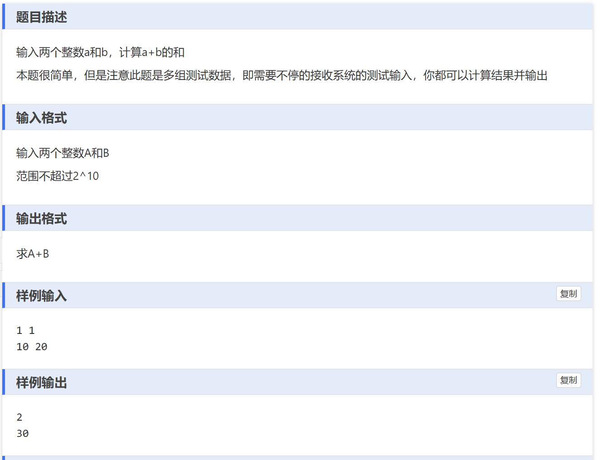

# 题目练习

1. 多组数据输入：

   1. while(~scanf("%d %d", &A, &B))和while(scanf("%d %d", &A, &B)!=EOF)完全一致，因读取成功时，scanf返回2，读取不成功时返回0，2和0取反均不为0，进入循环。而返回EOF即-1时，取反为0（1111取反），退出循环。
   2. 为什么while(1)循环不行：在结束输入后，printf将一直输出最后一组数的结果。因此上传后报错输出超限。

2. double输入必须用%lf，若用%f会出错。但输出在printf里无论是f还是lf都当成double输出。

3. ~与!的区别是~为按位取反，只有-1取反为0，其他数取反都非0；!则是非零取反都为0，0取反为1。
